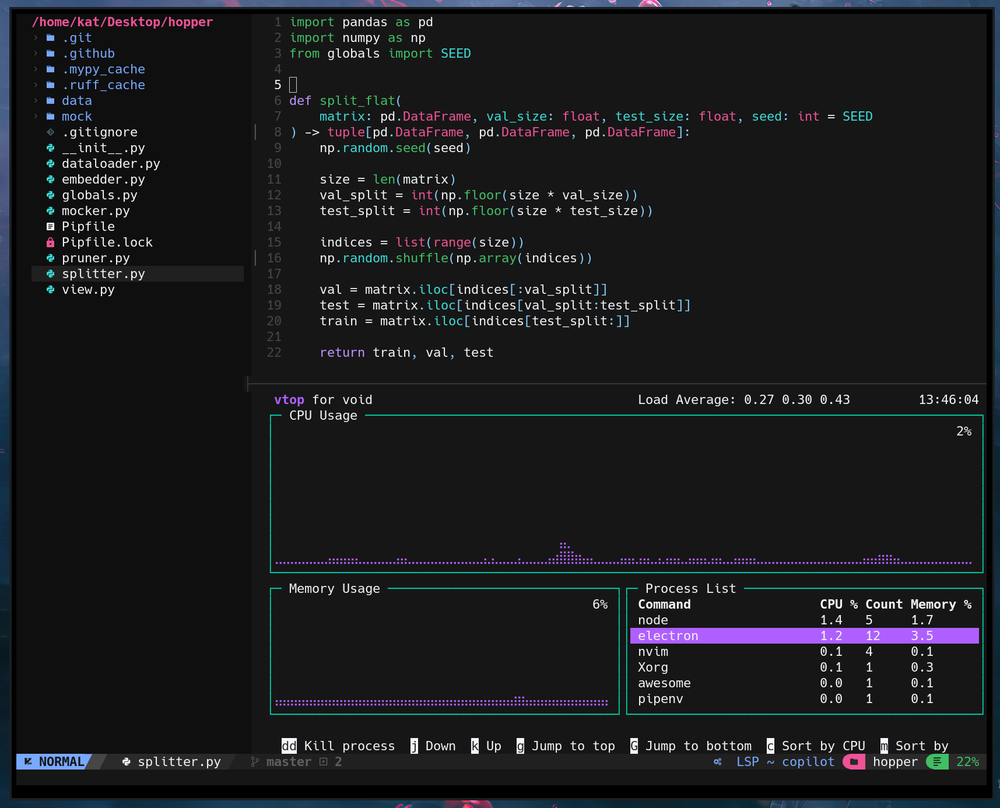
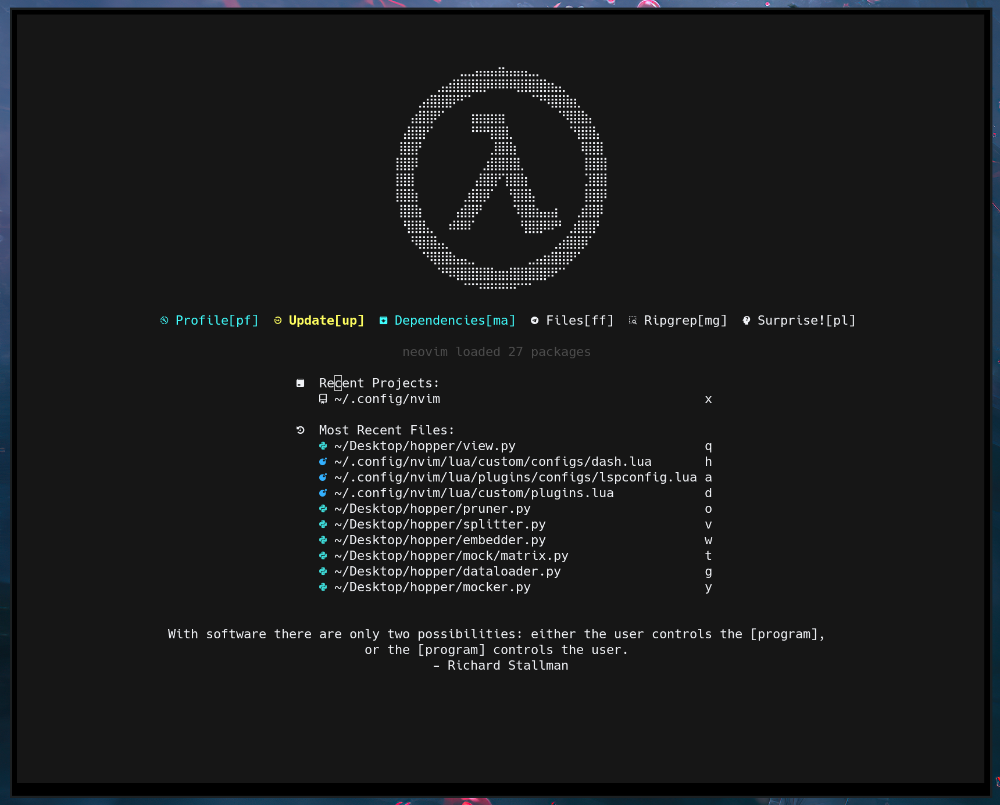
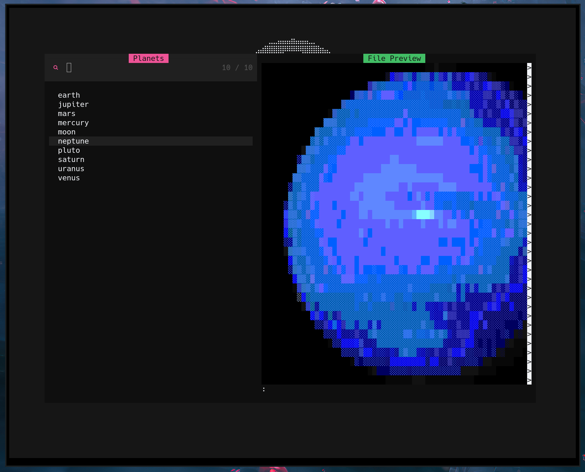
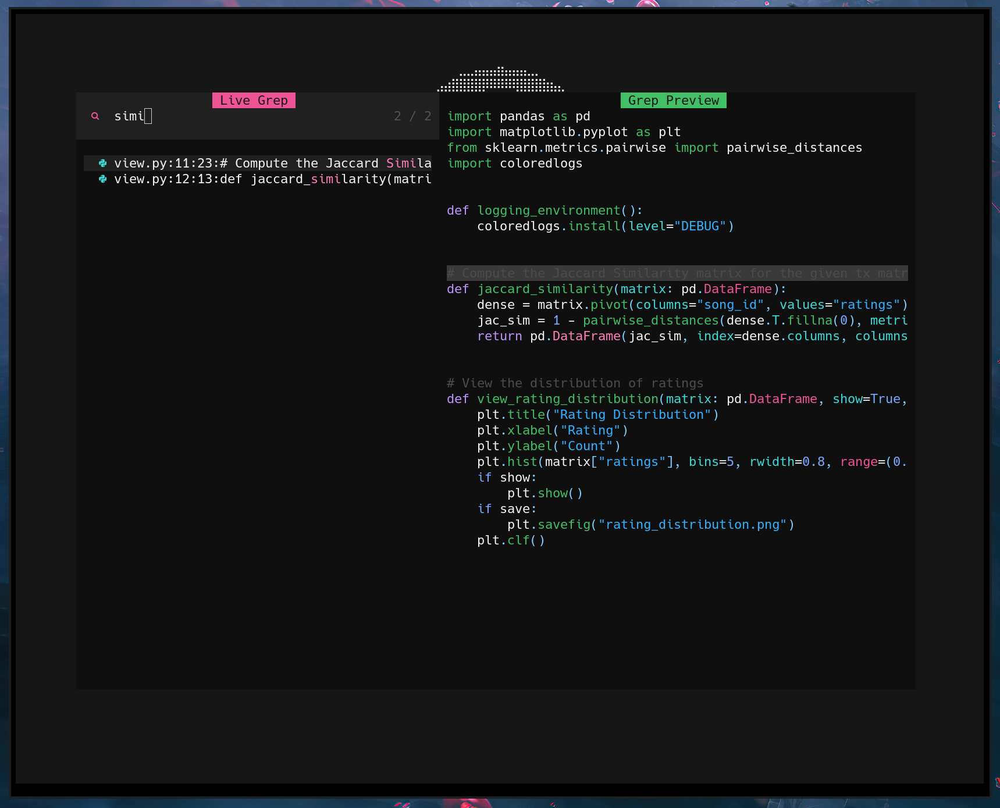
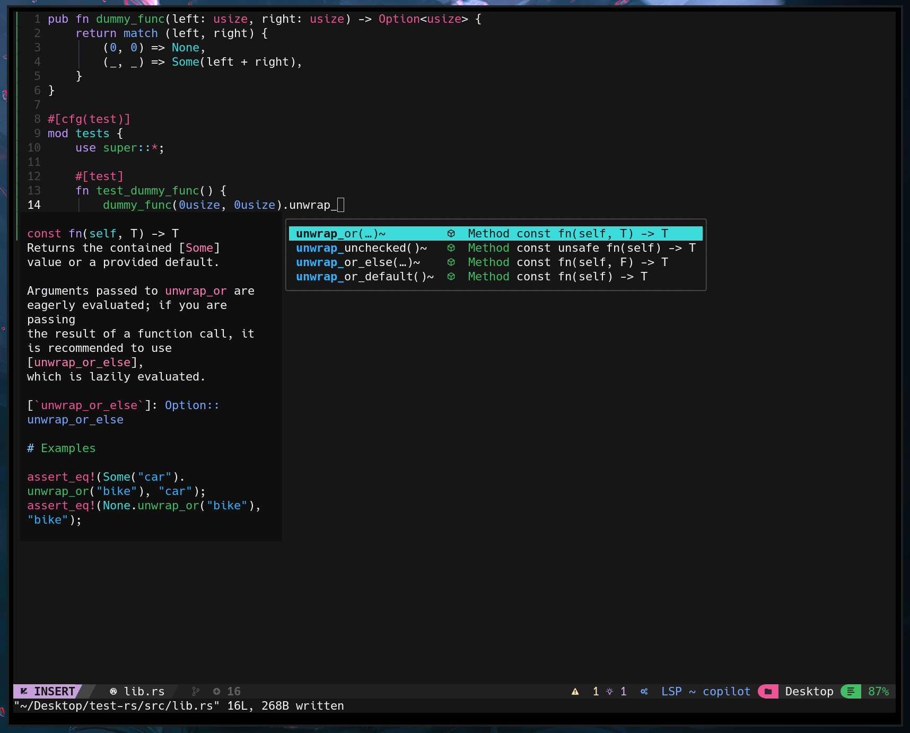

## Just a Hack
__Protocol7__ is _just a hack_. It's a simple neovim configuration written in _pure [Fennel](https://fennel-lang.org)_. It is not meant to be a one-size-fits-all, nor was it written as a framework to be expanded upon.

It's _just a simple config_ that demonstrates a method for embedding _Fennel_ as compiled _Lua_ code.

# Core Plugins
- _Some configs_ have been bootstrapped from [NvChad](https://github.com/nvchad/nvchad), namely:
    - [Telescope](https://github.com/nvim-telescope/telescope.nvim)
    - [Mason](https://github.com/williamboman/mason.nvim)
- Additional features include:
    - Custom dashboard using [dashboard.nvim](https://github.com/nvimdev/dashboard-nvim).
    - Pre-configured LSPs for _Rust_, _Python_, and _Typescript_, and an interactive _Fennel_ environment with [conjure](https://github.com/olical/conjure).
    - [copilot.vim](https://github.com/github/copilot.vim) installed _by default_.

### _oxocarbon_
[nyoom-engineering](https://github.com/nyoom-engineering)'s [oxocarbon](https://github.com/nyoom-engineering/oxocarbon.nvim) theme:


> [NvChad](https://github.com/nvchad/nvchad)'s Terminal-integration with [NvTerm](https://github.com/NvChad/nvterm) **is not pre-installed** but can be easily included.

### Dashboard
Overides _Neovim_'s start screen with a more powerful interface using [dashboard.nvim](https://github.com/nvimdev/dashboard-nvim).



##### Surprise!
The dashboard has a surprise in there, but I'm going to spoil it anyway:



> The `pl` key maps to `Telescope planets`. 

Of course, there a more useful hotkeys in the dashboard as well.
- `pf` for inspecting `Lazy profile`
- `up` for updating packages with [Lazy](https://github.com/folke/lazy.nvim),
- `ma` for viewing `Mason` dependencies,
- `ff` for `Telescope find_files`,
- `mg` for `Telescope live_grep`.



> Using `mg` from the dashboard.

### Pre-configured LSPs
For the following languages,
- _Rust_
- _Python_
- _TypeScript_

### Interactive Environments
- [x] _Fennel_
- [ ] _Clojure_
- [ ] _Common Lisp_
- [ ] _Scheme_
- [ ] _... everything else [conjure](https://github.com/olical/conjure) supports_

Non-checked environments can easily be configured through _conjure_'s configuration file.



## How Can I Use _Protocol7_ as an Example for My Own Config?
_Protocol7_ employs the following directory structure and a `Makefile` for building _Fennel_ source code into compiled _Lua_. The `Makefile` will recursively compile all `.fnl` code
present in the `src/` dir, and output it's correlated `.lua` module in the `build/` dir (e.g. `src/x.fnl` gets compiled to `build/x.lua`).

#### Before running `make`
```sh
.
├── Makefile
├── lazy-lock.json
└── src
    ├── configs
    │   ├── autopair.fnl
    │   ├── conjure.fnl
    │   ├── dash.fnl
    │   ├── lsp.fnl
    │   ├── mason.fnl
    │   ├── telescope.fnl
    │   ├── theme.fnl
    │   └── treesitter.fnl
    ├── globals.fnl
    ├── init.fnl
    └── plugins.fnl

```
#### After running `make`
```sh
.
├── Makefile
├── build
│   ├── configs
│   │   ├── autopair.lua
│   │   ├── conjure.lua
│   │   ├── dash.lua
│   │   ├── lsp.lua
│   │   ├── mason.lua
│   │   ├── telescope.lua
│   │   ├── theme.lua
│   │   └── treesitter.lua
│   ├── globals.lua
│   └── plugins.lua
├── init.lua
├── lazy-lock.json
└── src
    ├── configs
    │   ├── autopair.fnl
    │   ├── conjure.fnl
    │   ├── dash.fnl
    │   ├── lsp.fnl
    │   ├── mason.fnl
    │   ├── telescope.fnl
    │   ├── theme.fnl
    │   └── treesitter.fnl
    ├── globals.fnl
    ├── init.fnl
    └── plugins.fnl
```

The compiled `init.lua` is placed at the root folder, while all other modules are stored in `build/`.

### Plugins
Plugins are defined in `plugins.fnl`, with their relevant options being defined in `configs/x.fnl`:
```Fennel
(local plug {})

(lambda push-plugin [identifier opts]
  (if (= opts {})
    (table.insert plug identifier)
    (do
      (let [plugin-spec {}]
        (table.insert plugin-spec identifier)
        (each [k v (pairs opts)]
          (tset plugin-spec k v))
        (table.insert plug plugin-spec)))))

(lambda plugins []
    (push-plugin "folke/neoconf.nvim"               {:cmd "Neoconf"})
    (push-plugin "olical/conjure"                   (require :configs.conjure))
    (push-plugin "nvim-treesitter/nvim-treesitter"  (require :configs.treesitter))
    (push-plugin "williamboman/mason.nvim"          (require :configs.mason))
    (push-plugin "nyoom-engineering/oxocarbon.nvim" (require :configs.theme))
    (push-plugin "neovim/nvim-lspconfig"            (require :configs.lsp))
    (push-plugin "windwp/nvim-autopairs"            (require :configs.autopair))
    (push-plugin "glepnir/dashboard-nvim"           (require :configs.dash))
    (push-plugin "nvim-telescope/telescope.nvim"    (require :configs.telescope))
    (push-plugin "folke/neodev.nvim"                {})
    (push-plugin "folke/which-key.nvim"             {})
  plug)

(plugins)
```

